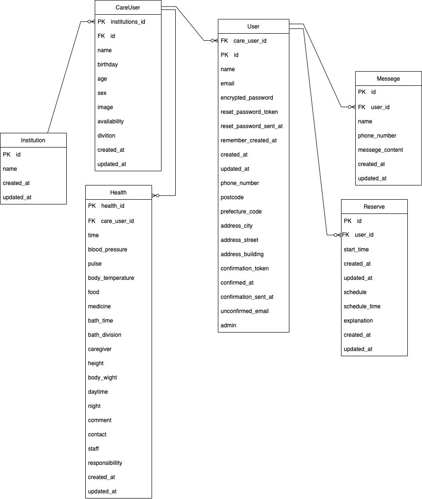
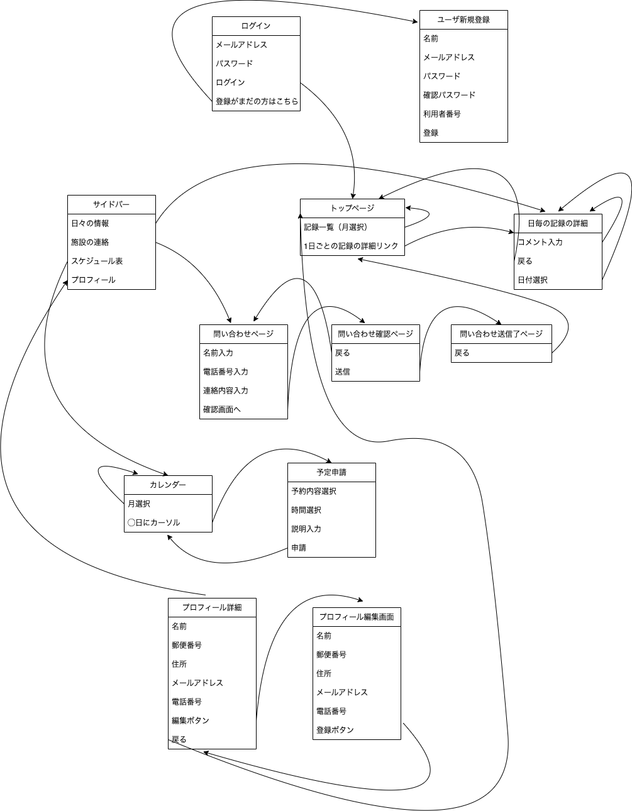

# README

# 開発言語
- Ruby 3.0.1
- Ruby on Rails 6.1.7

# 就職Termの技術
- devise
- Ajaxコメント機能
- AWS
- 1対1のメッセージ機能

# カリキュラム外の技術
- カレンダー機能
- ransack

# 実行手順
```
$ git clone git@github.com:richun06/original_app.git
$ cd original_app
$ bundle install
$ rails db:create && rails db:migrate
$ rails s
```


# カタログ設計
https://docs.google.com/spreadsheets/d/1v_arWeIlCeSx6K90vhjTjI8Zh70BiVmmk_BJ83enzic/edit#gid=610080528

# テーブル定義書
https://docs.google.com/spreadsheets/d/1v_arWeIlCeSx6K90vhjTjI8Zh70BiVmmk_BJ83enzic/edit#gid=1389939915

# ワイヤーフレーム
https://miro.com/app/board/uXjVP8_IhYo=/?share_link_id=748971264492

# ER図


# 画面遷移図
